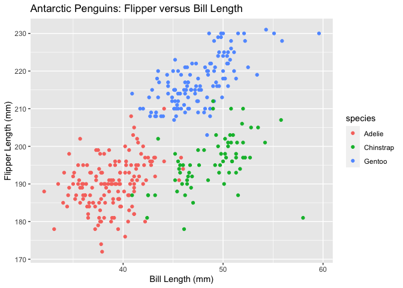

p8105\_hw1\_ll3344
================
Lusha Liang
9/13/2020

# Problem 1

## Creating a data frame

Here we are creating a data frame comprised of:

  - A random sample of size 10 from a standard normal distribution
  - A logical vector indicating whether elements of the sameple are
    greater than 0
  - A character vector of length 10
  - A factor vector of length 10, with 3 different factor “levels”

<!-- end list -->

``` r
# load tidyverse
library(tidyverse)
```

    ## ── Attaching packages ─────────────────────────────────────────────────────────── tidyverse 1.3.0 ──

    ## ✓ ggplot2 3.3.2     ✓ purrr   0.3.4
    ## ✓ tibble  3.0.1     ✓ dplyr   0.8.5
    ## ✓ tidyr   1.1.0     ✓ stringr 1.4.0
    ## ✓ readr   1.3.1     ✓ forcats 0.5.0

    ## ── Conflicts ────────────────────────────────────────────────────────────── tidyverse_conflicts() ──
    ## x dplyr::filter() masks stats::filter()
    ## x dplyr::lag()    masks stats::lag()

``` r
# create data frame                 
set.seed(123)

df_prob_1 = tibble(
  vec_normal = rnorm(10),
  vec_logical = as.logical(vec_normal > 0),
  vec_char = c("Learning", "R", "is", "so", "much", "fun", "indeed", "I", "do", "declare"),
  vec_factor = factor(c("alpacas", "sloths", "pandas", "pandas", "sloths", "alpacas", "alpacas", "alpacas", "sloths", "pandas"))
)

df_prob_1
```

    ## # A tibble: 10 x 4
    ##    vec_normal vec_logical vec_char vec_factor
    ##         <dbl> <lgl>       <chr>    <fct>     
    ##  1    -0.560  FALSE       Learning alpacas   
    ##  2    -0.230  FALSE       R        sloths    
    ##  3     1.56   TRUE        is       pandas    
    ##  4     0.0705 TRUE        so       pandas    
    ##  5     0.129  TRUE        much     sloths    
    ##  6     1.72   TRUE        fun      alpacas   
    ##  7     0.461  TRUE        indeed   alpacas   
    ##  8    -1.27   FALSE       I        alpacas   
    ##  9    -0.687  FALSE       do       sloths    
    ## 10    -0.446  FALSE       declare  pandas

## (Attempting) means

The mean of vec\_normal is 0.0746256. The mean of vec\_logical is 0.5.
The mean of vec\_char is NA. This returns an error because the argument
is not numeric or logical and therefore taking the mean does not make
sense. The mean of vec\_factor is NA. This also returns an error because
the argument is not numeric or logical.

We can convert variables from one type to another in certain cases.
Below is code showing our attempt to convert logical, character, and
factor variables to numeric.

``` r
as.numeric(pull(df_prob_1, vec_logical))
as.numeric(pull(df_prob_1, vec_char))
as.numeric(pull(df_prob_1, vec_factor))
```

In the first case we will be successful in converting vec\_logical to
numeric in that R assumes that FALSE translates to 0 and TRUE translates
to 1 in numeric form. Since we have 5 “TRUE”s and 5 “FALSE”s, this
explains why our mean was 0.5.

In the case of the character and factor vectors, R will not be
successful in converting these vectors to numeric because there are no
built in assumptions as to what number (for example) alpacas should
translate to. This is why R returned an error when we tried to take the
means of these vectors.

## Additional data manipulation

Finally, we will do the following data manipulation:

1.  Convert the logical vector to numeric, and multiply the random
    sample by the result
2.  Convert the logical vector to a factor, and multiply the random
    sample by the result
3.  Convert the logical vector to a factor and then convert the result
    to numeric, and multiple the random sample by the result

<!-- end list -->

``` r
# Step 1
as.numeric(pull(df_prob_1, vec_logical)) * pull(df_prob_1, vec_normal)
```

    ##  [1] 0.00000000 0.00000000 1.55870831 0.07050839 0.12928774 1.71506499
    ##  [7] 0.46091621 0.00000000 0.00000000 0.00000000

``` r
# Step 2
as.factor(pull(df_prob_1, vec_logical)) * pull(df_prob_1, vec_normal)
```

    ## Warning in Ops.factor(as.factor(pull(df_prob_1, vec_logical)), pull(df_prob_1, :
    ## '*' not meaningful for factors

    ##  [1] NA NA NA NA NA NA NA NA NA NA

``` r
# Step 3
as.numeric(as.factor(pull(df_prob_1, vec_logical))) * pull(df_prob_1, vec_normal)
```

    ##  [1] -0.5604756 -0.2301775  3.1174166  0.1410168  0.2585755  3.4301300
    ##  [7]  0.9218324 -1.2650612 -0.6868529 -0.4456620

As shown above R returns an error when we try to multiply a factor in
the second step, but we are able to convert the factor to numeric, then
successfully multiply. Notably we see that R assumes factor levels start
at the number 1 so that the first level is coded as 1 and the second
level as 2, whereas FALSE and TRUE correspond to 0 and 1, respectively.

# Problem 2

In this problem, we will be looking at the penguins dataset, which is
available through the palmerpenguins package in R.

``` r
# load data
data("penguins", package = "palmerpenguins")
```

The penguins dataset contains information about Antarctic penguins.
Variables included are species, island, bill\_length\_mm,
bill\_depth\_mm, flipper\_length\_mm, body\_mass\_g, sex, year. This
includes the following information for each variable:

  - Species categories: Adelie, Chinstrap, Gentoo
  - Island categories: Biscoe, Dream, Torgersen
  - Bill length minimum and maximum value (in mm): 32.1, 59.6
  - Bill depth minimum and maximum value (in mm): 13.1, 21.5
  - Flipper length minimum and maximum value (in mm): 172, 231
  - Body mass minimum and maximum value (in g): 2700, 6300
  - Sex categories: female, male
  - Year categories: 2007, 2009

The dataset contains 8 different variables on 344 individual penguins.

The mean flipper length is 200.9152047 mm.

We will now make a scatterplot of flipper length versus bill length,
grouped by species.

``` r
# load dplyr
library(dplyr)

# create scatter plot using ggplot
penguins %>% 
  ggplot(aes(x = bill_length_mm, y = flipper_length_mm, 
             color = species)) +
  geom_point() + 
  ggtitle("Antarctic Penguins: Flipper versus Bill Length") + 
  xlab("Bill Length (mm)") + 
  ylab("Flipper Length (mm)")
```

<!-- -->

``` r
# export scatter plot to PDF
ggsave("penguins_scatter_plot.pdf", height = 6, width = 6)
```

This scatterplot shows that the different species of Antarctic penguins
have distinct relationships between flipper and bill lengths. The Adelie
penguins shown in salmon color have relatively short flippers and bills.
The Chinstrap penguins shown in green have short flippers but relatively
long bills. The Gentoo penguins shown in blue have both long flippers
and bills.
